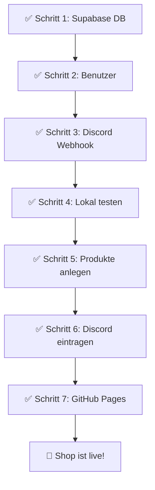

# 🎯 BulletFarm Shop — Komplette Einrichtungsanleitung

## Übersicht

Diese Anleitung führt dich Schritt für Schritt durch die komplette Einrichtung deines BulletFarm Shops. Folge die Schritte der Reihe nach.

| Schritt | Was wird gemacht | Dauer |
|---------|-----------------|-------|
| 1 | Supabase Datenbank einrichten | ~10 Min |
| 2 | Benutzer erstellen (Admin + Status-Only) | ~5 Min |
| 3 | Discord Webhook erstellen | ~3 Min |
| 4 | Shop lokal testen | ~5 Min |
| 5 | Kategorien & Produkte anlegen | ~10 Min |
| 6 | Discord Webhook im Admin Panel eintragen | ~2 Min |
| 7 | Auf GitHub Pages deployen | ~5 Min |

---

## Schritt 1: Supabase Datenbank einrichten

### 1.1 — Supabase Projekt öffnen

1. Gehe zu **[https://supabase.com/dashboard](https://supabase.com/dashboard)**
2. Öffne dein bestehendes Projekt (oder erstelle ein neues mit "New Project")
3. Klicke links auf **SQL Editor**
4. Klicke auf **"New query"**

### 1.2 — Tabellen erstellen

Kopiere den folgenden SQL-Code **komplett** und füge ihn im SQL-Editor ein. Dann klicke auf **"Run"** (grüner Button).

```sql
-- ============================================
-- KATEGORIEN
-- ============================================
CREATE TABLE IF NOT EXISTS categories (
  id UUID PRIMARY KEY DEFAULT gen_random_uuid(),
  name TEXT NOT NULL,
  icon TEXT DEFAULT '📦',
  color TEXT DEFAULT '#94a3b8',
  created_at TIMESTAMPTZ DEFAULT now()
);

-- ============================================
-- PRODUKTE
-- ============================================
CREATE TABLE IF NOT EXISTS products (
  id UUID PRIMARY KEY DEFAULT gen_random_uuid(),
  name TEXT NOT NULL,
  category_id UUID REFERENCES categories(id) ON DELETE SET NULL,
  description TEXT,
  image_url TEXT,
  price NUMERIC DEFAULT 0,
  resources JSONB DEFAULT '[]'::jsonb,
  variants JSONB DEFAULT '[]'::jsonb,
  badges TEXT[] DEFAULT '{}',
  status TEXT DEFAULT 'active' CHECK (status IN ('active','disabled','coming_soon')),
  is_bundle BOOLEAN DEFAULT false,
  bundle_items UUID[] DEFAULT '{}',
  stock INTEGER,
  sort_order INTEGER DEFAULT 0,
  created_at TIMESTAMPTZ DEFAULT now()
);

-- ============================================
-- BESTELLUNGEN
-- ============================================
CREATE TABLE IF NOT EXISTS orders (
  id UUID PRIMARY KEY DEFAULT gen_random_uuid(),
  status TEXT DEFAULT 'Offen' CHECK (status IN ('Offen','Bearbeitet','Archiviert','Storniert')),
  customer JSONB DEFAULT '{}'::jsonb,
  items JSONB DEFAULT '[]'::jsonb,
  discord_message_id TEXT,
  notes TEXT,
  created_at TIMESTAMPTZ DEFAULT now(),
  updated_at TIMESTAMPTZ DEFAULT now()
);

-- ============================================
-- BENUTZER-PROFILE (Rollen)
-- ============================================
CREATE TABLE IF NOT EXISTS profiles (
  id UUID PRIMARY KEY REFERENCES auth.users(id) ON DELETE CASCADE,
  email TEXT,
  role TEXT DEFAULT 'status_only' CHECK (role IN ('admin','status_only')),
  created_at TIMESTAMPTZ DEFAULT now()
);

-- ============================================
-- SHOP SETTINGS (Einstellungen — eine Zeile)
-- ============================================
CREATE TABLE IF NOT EXISTS shop_settings (
  id INTEGER PRIMARY KEY DEFAULT 1,
  data JSONB DEFAULT '{}'::jsonb
);

-- Initialwert anlegen
INSERT INTO shop_settings (id, data)
VALUES (1, '{}')
ON CONFLICT (id) DO NOTHING;
```

> [!IMPORTANT]
> Warte bis **"Success"** angezeigt wird, bevor du weitermachst!

### 1.3 — Auto-Profil Trigger erstellen

Öffne eine **neue Query** und füge diesen Code ein, dann klicke **"Run"**:

```sql
-- Trigger: Erstellt automatisch ein Profil bei neuer Registrierung
CREATE OR REPLACE FUNCTION public.handle_new_user()
RETURNS TRIGGER AS $$
BEGIN
  INSERT INTO public.profiles (id, email, role)
  VALUES (NEW.id, NEW.email, 'status_only');
  RETURN NEW;
END;
$$ LANGUAGE plpgsql SECURITY DEFINER;

DROP TRIGGER IF EXISTS on_auth_user_created ON auth.users;
CREATE TRIGGER on_auth_user_created
  AFTER INSERT ON auth.users
  FOR EACH ROW EXECUTE FUNCTION public.handle_new_user();
```

### 1.4 — Sicherheitsregeln (RLS) aktivieren

Öffne eine **neue Query** und füge diesen Code ein, dann klicke **"Run"**:

```sql
-- RLS aktivieren
ALTER TABLE categories ENABLE ROW LEVEL SECURITY;
ALTER TABLE products ENABLE ROW LEVEL SECURITY;
ALTER TABLE orders ENABLE ROW LEVEL SECURITY;
ALTER TABLE profiles ENABLE ROW LEVEL SECURITY;
ALTER TABLE shop_settings ENABLE ROW LEVEL SECURITY;

-- CATEGORIES: Jeder kann lesen, nur Admin kann schreiben
CREATE POLICY "categories_read" ON categories FOR SELECT USING (true);
CREATE POLICY "categories_admin" ON categories FOR ALL USING (
  EXISTS (SELECT 1 FROM profiles WHERE id = auth.uid() AND role = 'admin')
);

-- PRODUCTS: Jeder kann lesen, nur Admin kann schreiben
CREATE POLICY "products_read" ON products FOR SELECT USING (true);
CREATE POLICY "products_admin" ON products FOR ALL USING (
  EXISTS (SELECT 1 FROM profiles WHERE id = auth.uid() AND role = 'admin')
);

-- ORDERS: Jeder kann bestellen, Auth-User können lesen + updaten
CREATE POLICY "orders_insert" ON orders FOR INSERT WITH CHECK (true);
CREATE POLICY "orders_read" ON orders FOR SELECT USING (
  auth.uid() IS NOT NULL AND
  EXISTS (SELECT 1 FROM profiles WHERE id = auth.uid() AND role IN ('admin','status_only'))
);
CREATE POLICY "orders_update" ON orders FOR UPDATE USING (
  auth.uid() IS NOT NULL AND
  EXISTS (SELECT 1 FROM profiles WHERE id = auth.uid() AND role IN ('admin','status_only'))
);
CREATE POLICY "orders_delete" ON orders FOR DELETE USING (
  EXISTS (SELECT 1 FROM profiles WHERE id = auth.uid() AND role = 'admin')
);

-- PROFILES: Nur eigenes Profil lesen
CREATE POLICY "profiles_read_own" ON profiles FOR SELECT USING (id = auth.uid());

-- SHOP_SETTINGS: Jeder kann lesen, nur Admin kann schreiben
CREATE POLICY "settings_read" ON shop_settings FOR SELECT USING (true);
CREATE POLICY "settings_admin" ON shop_settings FOR ALL USING (
  EXISTS (SELECT 1 FROM profiles WHERE id = auth.uid() AND role = 'admin')
);
```

> [!TIP]
> Falls eine "policy already exists"-Meldung kommt, ist das kein Problem — einfach ignorieren.

✅ **Datenbank ist jetzt vollständig eingerichtet!**

---

## Schritt 2: Benutzer erstellen

### 2.1 — Admin-Benutzer erstellen

1. Gehe im Supabase Dashboard zu **Authentication** (linke Sidebar)
2. Klicke auf **Users** (oben)
3. Klicke auf **"Add user"** → **"Create new user"**
4. Gib ein:
   - **Email:** deine Admin-Email (z.B. `admin@bulletfarm.de`)
   - **Password:** ein sicheres Passwort
   - ✅ Haken bei **"Auto Confirm User"** setzen!
5. Klicke **"Create user"**

### 2.2 — Admin-Rolle zuweisen

1. Gehe zum **SQL Editor**
2. Führe aus (Email anpassen!):

```sql
UPDATE profiles SET role = 'admin' WHERE email = 'admin@bulletfarm.de';
```

> [!CAUTION]
> ⚠️ Ersetze `admin@bulletfarm.de` durch die echte Email, die du gerade erstellt hast!

### 2.3 — Status-Only Benutzer erstellen (optional)

Diesen Benutzer können Mitarbeiter nutzen, die nur Bestellstatus ändern dürfen:

1. Gehe wieder zu **Authentication → Users → Add user**
2. Erstelle einen neuen User (z.B. `status@bulletfarm.de`)
3. ✅ **"Auto Confirm User"** aktivieren
4. **Fertig!** — Der Trigger erstellt automatisch ein Profil mit `role = 'status_only'`

> [!NOTE]
> **Rollen-Übersicht:**
> | Rolle | Kann |
> |-------|------|
> | `admin` | Alles: Produkte, Kategorien, Bestellungen, Theme, Discord |
> | `status_only` | Nur Bestellstatus ändern (Offen → Bearbeitet → Archiviert) |

✅ **Benutzer sind eingerichtet!**

---

## Schritt 3: Discord Webhook erstellen

### 3.1 — Webhook in Discord erstellen

1. Öffne **Discord** (Desktop oder Browser)
2. Gehe zu deinem **Server** → wähle den **Kanal**, in dem Bestellungen ankommen sollen
3. Klicke auf das **⚙️ Zahnrad** neben dem Kanalnamen (Kanal bearbeiten)
4. Gehe zu **Integrationen** (linke Sidebar)
5. Klicke auf **"Webhooks"**
6. Klicke auf **"Neuer Webhook"**
7. Optional: Ändere den **Namen** (z.B. "BulletFarm Orders") und das **Profilbild**
8. Klicke auf **"Webhook-URL kopieren"** — **Speichere diese URL!** Du brauchst sie in Schritt 6.

> [!WARNING]
> Teile die Webhook-URL mit niemandem! Wer die URL hat, kann Nachrichten in deinem Kanal senden.

✅ **Discord Webhook ist erstellt!**

---

## Schritt 4: Shop lokal testen

### 4.1 — Server starten (falls noch nicht läuft)

Öffne ein Terminal im Projektordner und starte:

```
npx -y serve d:\Antigravity\Bulletfarm-Shop -l 3456
```

### 4.2 — Shop öffnen

1. Öffne deinen Browser
2. Gehe zu **[http://localhost:3456/](http://localhost:3456/)**
3. Du solltest den Shop sehen:
   - Dunkles Design mit Header "BulletFarm"
   - Buttons: Shop, Warenkorb, Admin
   - Produktbereich (noch leer — das kommt in Schritt 5)

### 4.3 — Admin Panel testen

1. Gehe zu **[http://localhost:3456/admin.html](http://localhost:3456/admin.html)**
2. Du siehst ein Login-Formular
3. Logge dich ein mit der Admin-Email und Passwort aus Schritt 2
4. Du solltest das Admin Panel sehen mit der Sidebar:
   - 📦 Produkte
   - 📂 Kategorien
   - 📋 Bestellungen
   - 🎨 Theme
   - 💬 Discord

✅ **Shop läuft lokal!**

---

## Schritt 5: Kategorien und Produkte anlegen

### 5.1 — Kategorien erstellen

1. Im **Admin Panel** → klicke auf **📂 Kategorien** (Sidebar)
2. Gib einen **Namen** ein (z.B. "Fahrzeuge")
3. Wähle ein **Icon** (Emoji, z.B. "🚗")
4. Wähle eine **Farbe** für die Kategorie
5. Klicke **✅ Erstellen**
6. Wiederhole für weitere Kategorien:
   - z.B. **🏠 Immobilien**, **🔫 Waffen**, **📦 Materialien**, **🧩 Bundles**, etc.

### 5.2 — Produkte erstellen

1. Im **Admin Panel** → klicke auf **📦 Produkte** (Sidebar)
2. Fülle das Formular aus:

| Feld | Beschreibung | Beispiel |
|------|-------------|---------|
| **Name** | Produktname | "Elegy Retro Custom" |
| **Kategorie** | Aus Dropdown wählen | "🚗 Fahrzeuge" |
| **Bild URL** | Link zu einem Bild | `https://i.imgur.com/xyz.jpg` |
| **Status** | Aktiv, Bald, Deaktiviert | "✅ Aktiv" |
| **Beschreibung** | Optionale Beschreibung | "Tuning-Fahrzeug mit..." |
| **Bestand** | Leer = unbegrenzt | `10` oder leer |
| **Sortierung** | Reihenfolge (0 = oben) | `0` |

3. **Ressourcen hinzufügen** (der "Preis"):
   - Name: z.B. `DeadCoin`
   - Menge: z.B. `50000`
   - Farbe wählen
   - Klicke **"+ Hinzufügen"**
   - Du kannst mehrere Ressourcen pro Produkt hinzufügen

4. **Varianten** (optional — z.B. verschiedene Größen):
   - Name: z.B. `Small`
   - Multiplier: `1`
   - **"+ Hinzufügen"**, dann:
   - Name: `Large`, Multiplier: `3`
   - → Die Ressourcen werden mit dem Multiplier multipliziert

5. **Badges** (optional):
   - Haken setzen bei 🔥 Beliebt, 💎 Premium, 💸 Sale, oder ✨ Neu

6. Klicke **✅ Erstellen**

7. **Wiederhole** für alle weiteren Produkte

> [!TIP]
> **Bilder hochladen:** Du kannst Bilder auf [imgur.com](https://imgur.com) oder [postimages.org](https://postimages.org) hochladen und die URL als Bild-URL verwenden.

### 5.3 — Shop prüfen

1. Gehe zurück zum **Shop** → [http://localhost:3456/](http://localhost:3456/)
2. Lade die Seite neu (F5 oder Strg+R)
3. Deine Produkte sollten jetzt sichtbar sein!
4. Teste:
   - 🔍 Suche funktioniert?
   - 📂 Kategorie-Filter funktioniert?
   - 🛒 "In den Warenkorb" klicken → Warenkorb öffnen
   - Menge ändern / Produkt entfernen

✅ **Produkte sind angelegt!**

---

## Schritt 6: Discord Webhook eintragen

1. Im **Admin Panel** → klicke auf **💬 Discord** (Sidebar)
2. Füge die **Webhook-URL** ein (aus Schritt 3)
3. Klicke **💾 Speichern**
4. Klicke **🧪 Test senden** → Prüfe ob eine Nachricht in Discord erscheint

### 6.1 — Bestellung testen

1. Gehe zum **Shop** → [http://localhost:3456/](http://localhost:3456/)
2. Füge ein Produkt zum Warenkorb hinzu
3. Öffne den **Warenkorb**
4. Gib einen **Namen** und **Discord-Name** ein
5. Klicke **✅ Bestellung absenden**
6. Prüfe:
   - ✅ Toast "Bestellung aufgegeben" erscheint
   - ✅ Discord-Nachricht mit Bestelldetails erscheint

### 6.2 — Status-Update testen

1. Im **Admin Panel** → **📋 Bestellungen**
2. Du solltest deine Testbestellung sehen
3. Ändere den Status auf **"Bearbeitet"** und klicke **💾**
4. Prüfe Discord: Die originale Nachricht sollte sich aktualisiert haben (Farbe und Status ändern sich!)

✅ **Discord Integration funktioniert!**

---

## Schritt 7: Auf GitHub Pages deployen

### 7.1 — Git Repository erstellen (falls noch nicht vorhanden)

Öffne ein Terminal im Projektordner:

```bash
cd d:\Antigravity\Bulletfarm-Shop
git init
git add .
git commit -m "BulletFarm Shop v1.0"
```

### 7.2 — GitHub Repository erstellen

1. Gehe zu **[https://github.com/new](https://github.com/new)**
2. Repository Name: `Bulletfarm-Shop`
3. Visibility: **Public** (für GitHub Pages) oder **Private** (für Pro-Accounts)
4. Klicke **"Create repository"**

### 7.3 — Code hochladen

Folge den Anweisungen auf der GitHub-Seite, oder führe aus:

```bash
git remote add origin https://github.com/DEIN-USERNAME/Bulletfarm-Shop.git
git branch -M main
git push -u origin main
```

> [!CAUTION]
> ⚠️ Ersetze `DEIN-USERNAME` durch deinen GitHub-Benutzernamen!

### 7.4 — GitHub Pages aktivieren

1. Gehe auf GitHub zu deinem Repository
2. Klicke auf **Settings** (Zahnrad oben rechts)
3. Scroll links runter zu **Pages**
4. Unter **"Source"** wähle:
   - Branch: **main**
   - Folder: **/ (root)**
5. Klicke **"Save"**
6. **Warte 1-2 Minuten** — GitHub baut deine Seite

### 7.5 — Fertig!

Dein Shop ist jetzt erreichbar unter:

```
https://DEIN-USERNAME.github.io/Bulletfarm-Shop/
```

> [!TIP]
> **Custom Domain:** Wenn du eine eigene Domain hast (z.B. `shop.bulletfarm.de`), kannst du sie unter Settings → Pages → Custom domain eintragen.

✅ **Shop ist live!** 🎉

---

## Zusammenfassung



## Häufige Probleme

| Problem | Lösung |
|---------|--------|
| "No rows returned" beim Admin-Login | SQL aus Schritt 1.3 (Trigger) nochmal ausführen, dann User neu erstellen |
| Produkte werden nicht angezeigt | Browser-Cache leeren (Strg+Shift+R) |
| Discord-Nachricht kommt nicht | Webhook-URL im Admin Panel prüfen, Test senden |
| "policy already exists" Fehler | Kein Problem — einfach ignorieren |
| Login funktioniert nicht | "Auto Confirm User" beim Erstellen des Users aktiviert? |
| Shop zeigt Fehler nach Deploy | Supabase URL in `js/supabase-config.js` prüfen |
